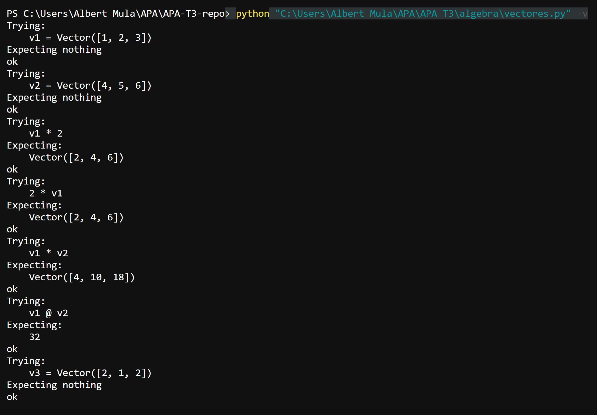
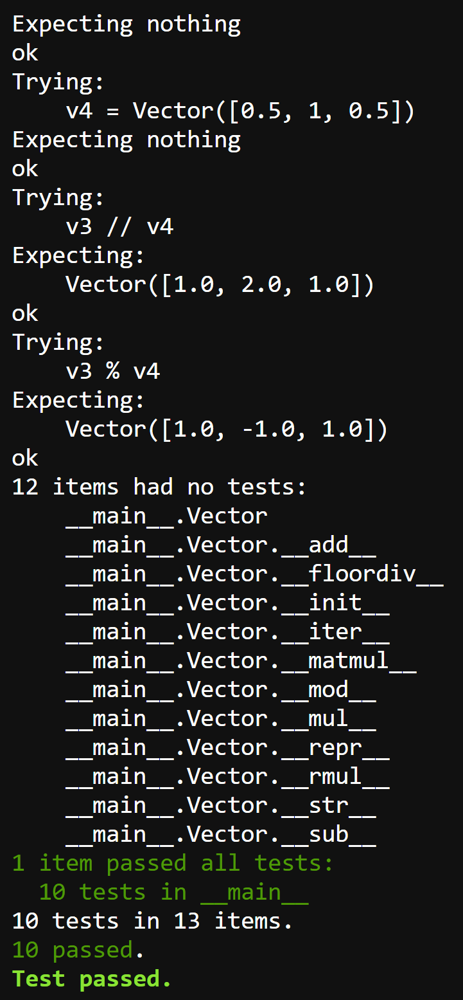

# APA-T3: Multiplicación de vectores y ortogonalidad

**Alumno:** Ricard Mula Cañameras

## Descripción

Implementación de operadores de multiplicación vectorial y ortogonalidad en la clase `Vector`:

- `*` — Producto de Hadamard o multiplicación por escalar
- `@` — Producto escalar (dot product)
- `//` — Componente paralela de un vector respecto a otro
- `%` — Componente perpendicular de un vector respecto a otro

## Ejecución de los tests unitarios




## Código desarrollado

```python
def __mul__(self, other):
    """
    Multiplica el vector por un escalar o calcula el producto de Hadamard.
    """
    if isinstance(other, (int, float)):
        return Vector(a * other for a in self)
    return Vector(a * b for a, b in zip(self, other))

def __rmul__(self, other):
    """
    Multiplica un escalar por el vector (conmutativa).
    """
    return self.__mul__(other)

def __matmul__(self, other):
    """
    Calcula el producto escalar (dot product) de dos vectores.
    """
    return sum(a * b for a, b in zip(self, other))

def __floordiv__(self, other):
    """
    Calcula la componente de self paralela (tangencial) a other.
    """
    return (self @ other / (other @ other)) * other

def __mod__(self, other):
    """
    Calcula la componente de self perpendicular (normal) a other.
    """
    return self - self // other
```